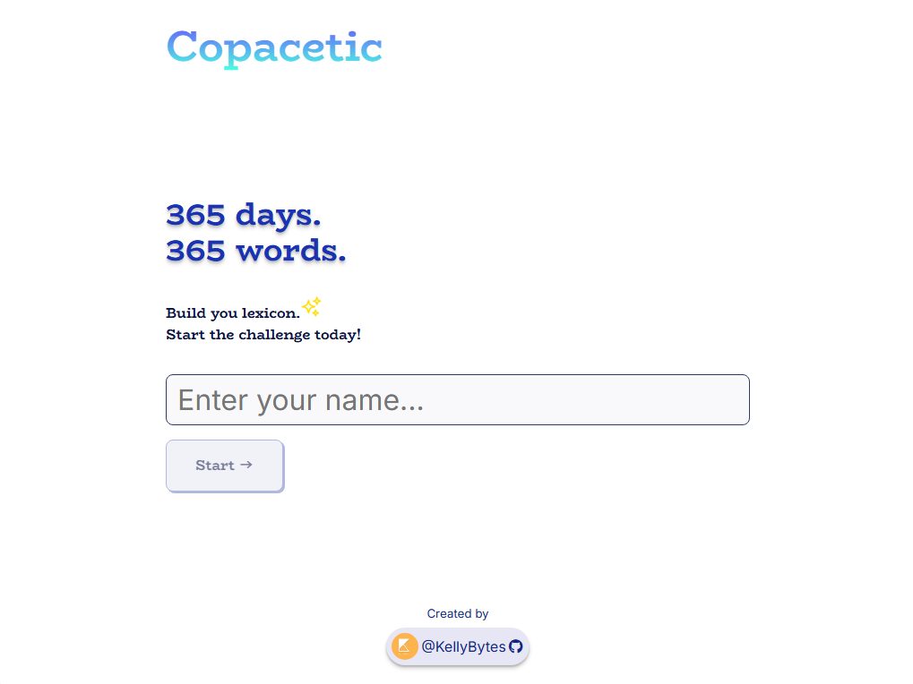
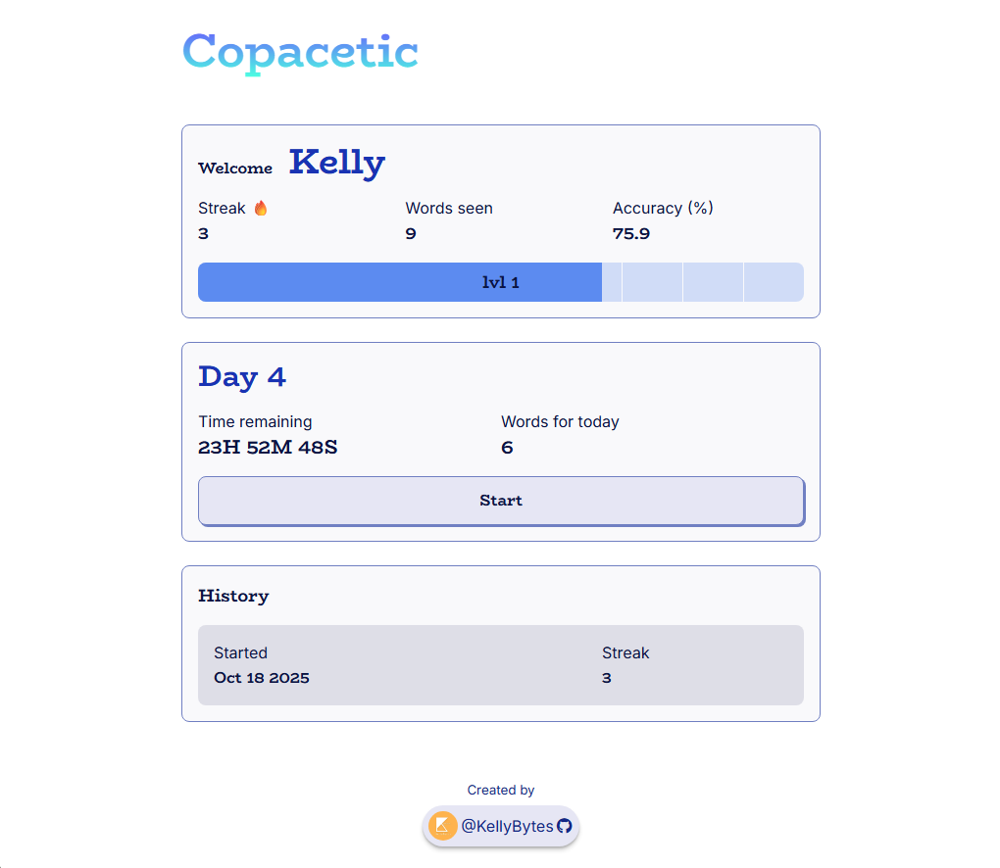
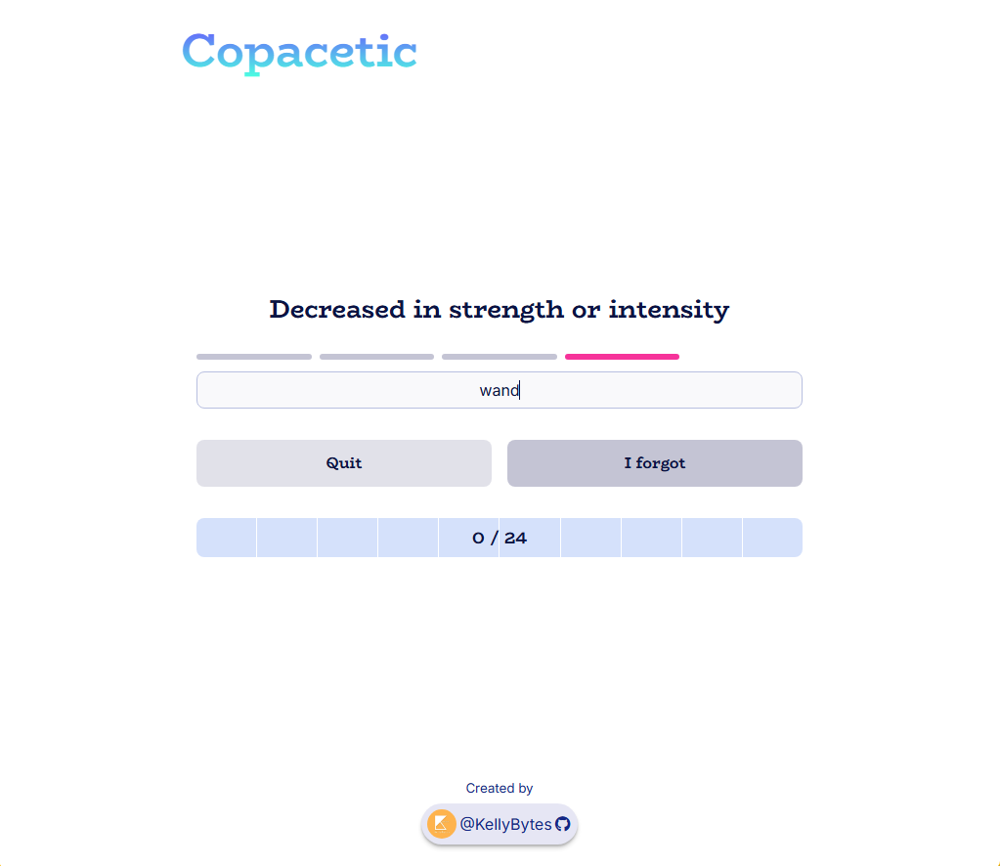
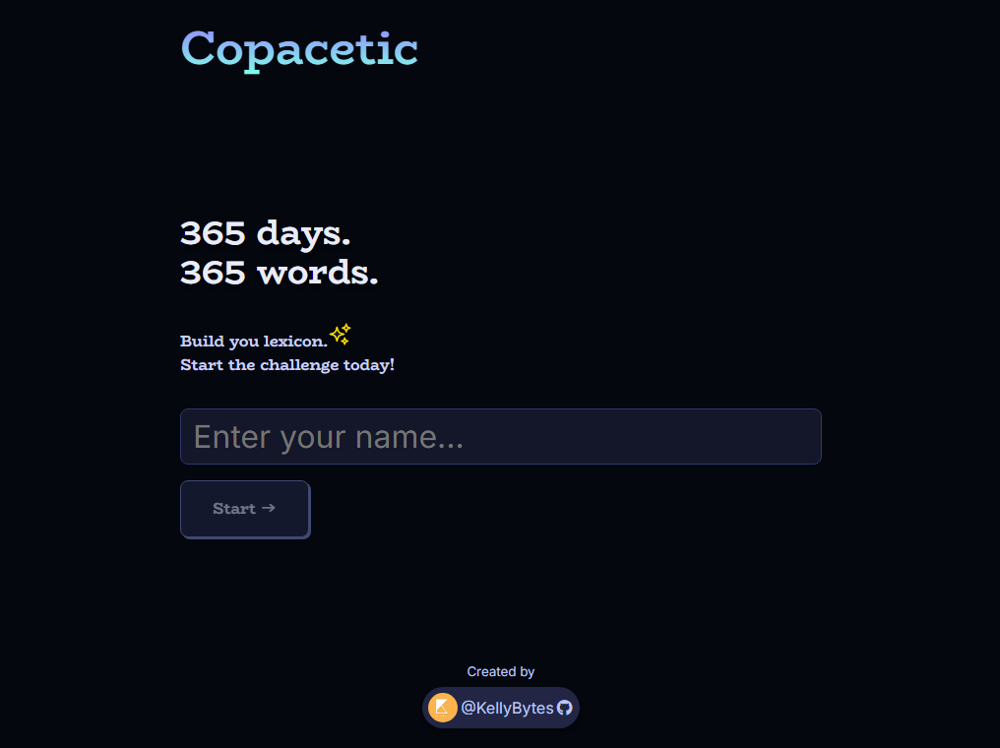
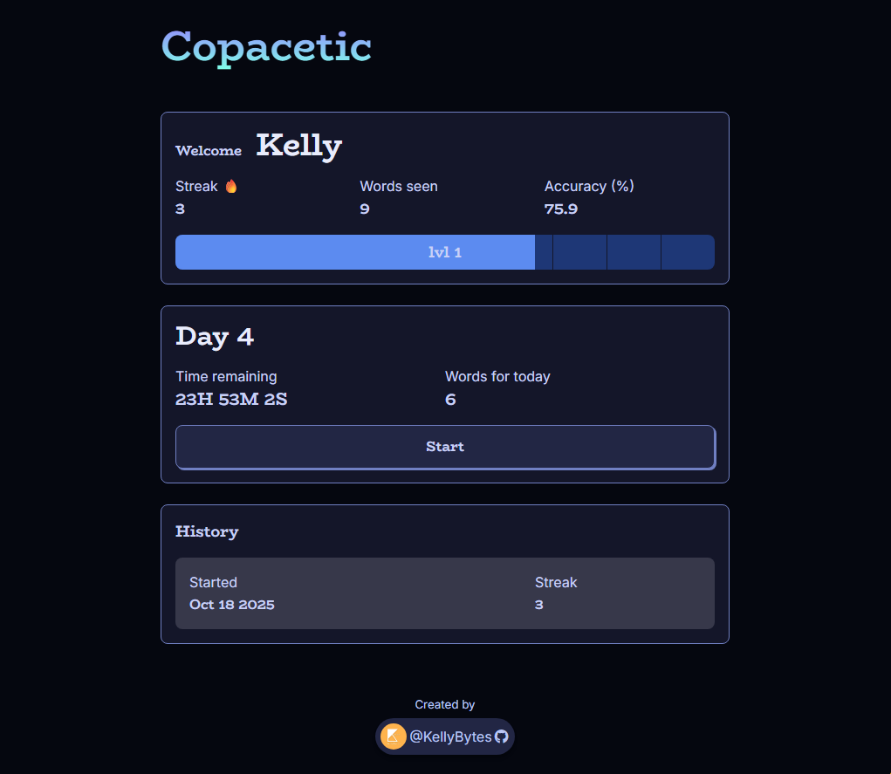
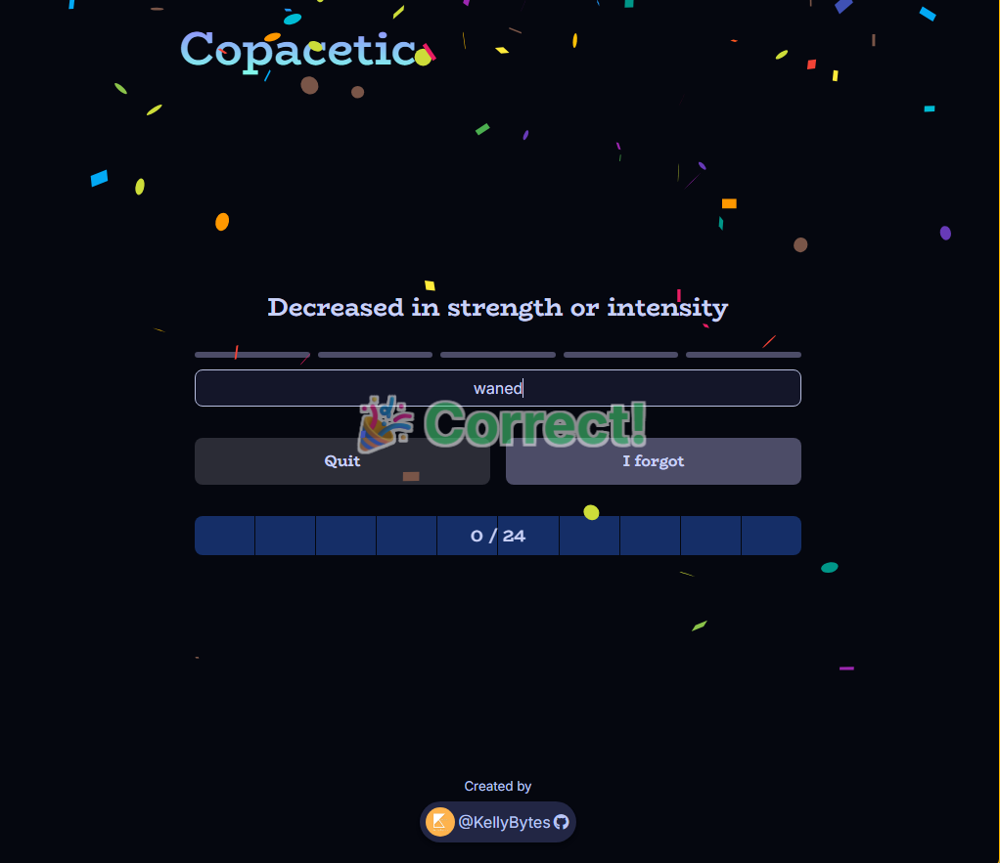

# ReactJS Full Course | Build a Smart Word Memory App

## Overview
A full-featured **Word Memory App** that:
- Helps users learn advanced vocabulary efficiently
- Uses **spaced repetition** to optimize memory retention
- Tracks streaks and learning progress
- Stores user data locally so nothing is lost
- Works beautifully on desktop and mobile
- Is **deployed live to the internet** by the end of the course

### Features
- Setting up a modern React project with Vite
- Functional components and JSX
- React state (useState) and events
- Lifting state and passing props
- Mapping, filtering, and conditional rendering
- Custom hooks for reuse and separation of concerns
- Spaced repetition logic and daily word scheduling
- Saving and retrieving progress with localStorage
- Gamifying learning with streaks and progress indicators
- Deploying React apps to the web with Netlify

Originally created by [jamezmca](https://github.com/jamezmca)

---

## Screenshots

<strong>Light Mode</strong>
  

    
    
    
     

<strong>Dard Mode</strong>
  

    
    
    
     

